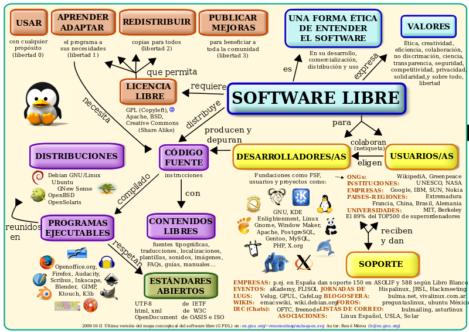

## T1  Introducción a los sistemas informáticos

- <a href="https://www.youtube.com/watch?v=8tpxARw1X04&t=145s">Historia de la informática</a>
- <a href="https://www.youtube.com/watch?v=HQF-QbIoTCw">Máquina de Turing</a> 
- <a href="https://www.youtube.com/watch?v=zDAYZU4A3w0">CPU Google</a>
- <a href="https://www.youtube.com/watch?v=2l6gI-ksdKs">Facebook Datacenter</a>

****

### Licencias Software Libre

**Práctica a entregar**: Realiza un trabajo sobre los orígenes de la informática. En el se deberá incluir:
- Generaciones de los ordenadores con sus características
- Origen de la informática moderna: Von Neumman vs Alan Turing

La fecha de entrega será el Lunes 16 de Septiembre en un archivo con formato word / pdf en la carpeta compartida de Drive con el siguiente nombre: practica1_nombre.pdf

****

